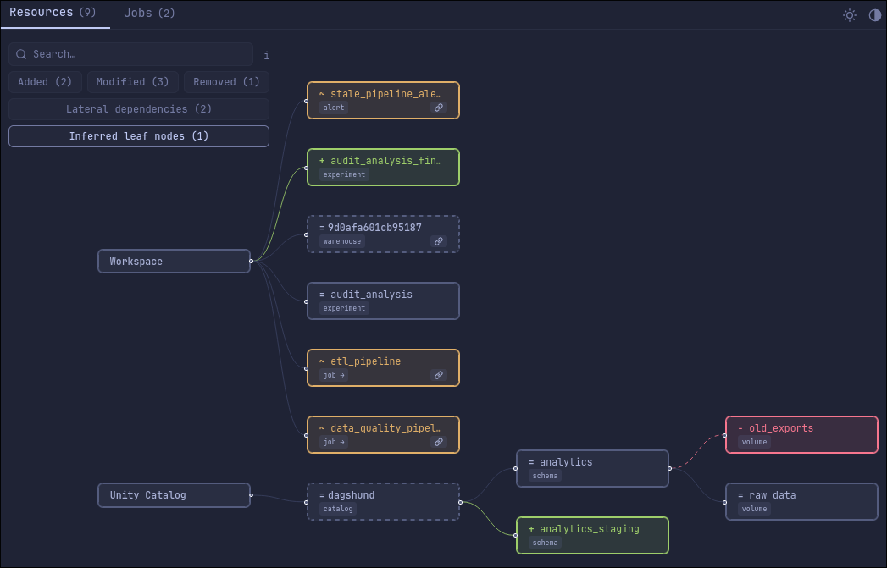
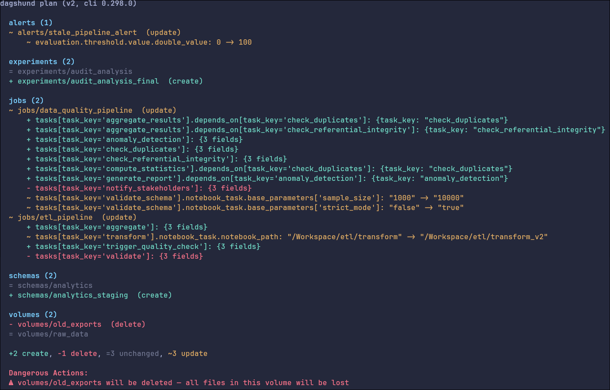
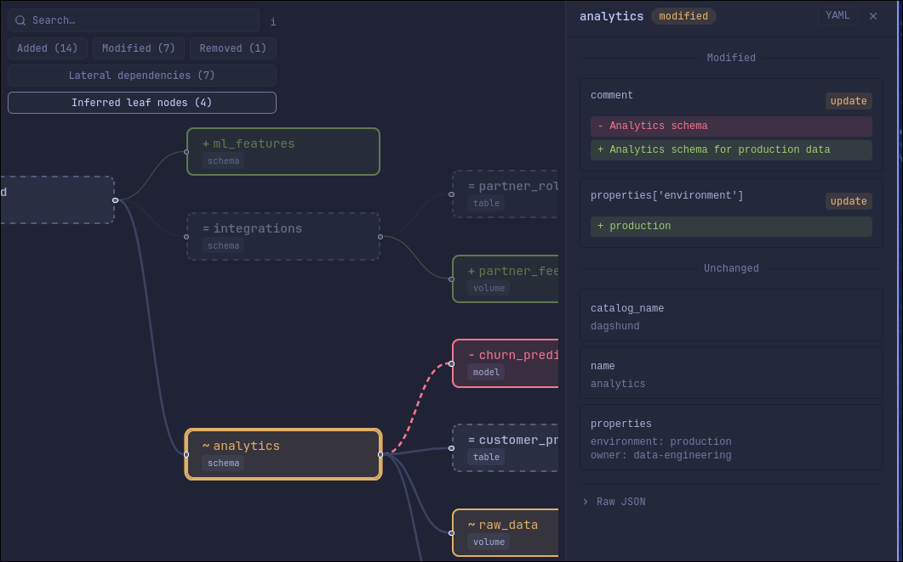
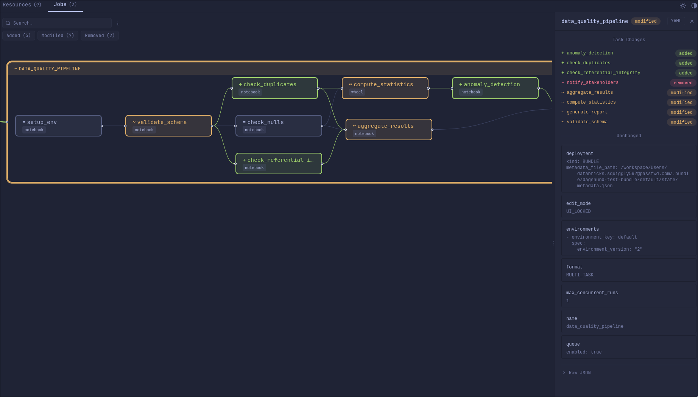
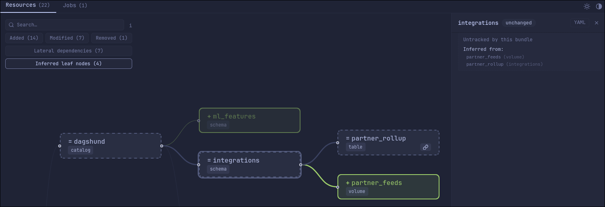
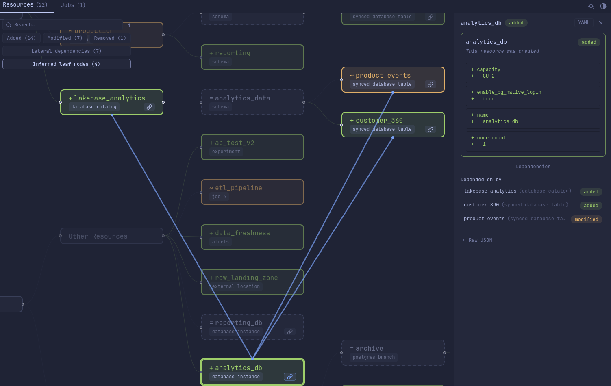
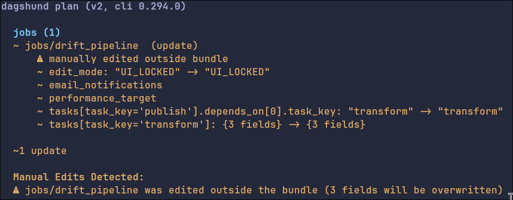

# Dagshund

Colored diff summaries and interactive DAG visualizations for Declarative Automation Bundles (formerly Databricks Asset Bundles). Requires a plan file from the [direct deployment engine](https://docs.databricks.com/aws/en/dev-tools/bundles/direct) (`databricks bundle plan -o json`). See what changed, what's new, and what's being deleted, in your terminal or in the browser.



## Install

Requires Python 3.12+.

```bash
# Run without installing (ephemeral)
uvx dagshund plan.json

# Persistent install
uv tool install dagshund

# Traditional pip
pip install dagshund
```

## Usage

By default, dagshund prints a colored text diff to the terminal:

```bash
dagshund plan.json
```



Export an interactive HTML visualization with `-o`:

```bash
dagshund plan.json -o report.html
```

Open it in the browser automatically with `-b`:

```bash
dagshund plan.json -o report.html -b
```

Reads from stdin, so you can pipe directly from the Databricks CLI:

```bash
databricks bundle plan -o json | dagshund
databricks bundle plan -o json | dagshund -o report.html
```

Dagshund works anywhere, it just needs a plan JSON file. You don't need to run it from inside your bundle directory.

Filter the output to specific change types:

```bash
dagshund plan.json -c              # changed resources only (hides unchanged)
dagshund plan.json -a              # added only
dagshund plan.json -m              # modified only
dagshund plan.json -a -r           # added and removed
```

The filter flags (`-a`, `-m`, `-r`) compose freely. `-c` is shorthand for `-a -m -r`.

Use `-f` to filter by resource type, name, or diff status with the same search DSL as the browser UI:

```bash
dagshund plan.json -f 'type:jobs'               # only jobs
dagshund plan.json -f 'status:added'             # only new resources
dagshund plan.json -f '"etl_pipeline"'            # exact name match
dagshund plan.json -f 'type:jobs pipeline'       # jobs matching "pipeline"
dagshund plan.json -c -f 'type:volumes'          # changed volumes only
```

All tokens in a filter expression AND together. `-f` composes with `-c`/`-a`/`-m`/`-r` — both must match.

Use `-e` for CI-friendly exit codes (see [CI Exit Codes](#ci-exit-codes)).

## Interactive Visualization

The HTML report shows your resources as an interactive graph with diff highlighting. Resources are organized into visual groups:

- **Workspace**, jobs, alerts, experiments, pipelines, and other bundle resources
- **Unity Catalog**, catalogs, schemas, volumes, and registered models in their hierarchy
- **Lakebase**, database instances and synced tables (when present, flat resources move into an "Other Resources" group)

Click any node to open a detail panel with per-field structural diffs, old values in red, new values in green, unchanged fields for context.



Jobs with task dependencies get their own DAG view. Switch between the Resources and Jobs tabs to navigate between them.



### Phantom Nodes

If your schema references a parent catalog that isn't in your bundle, dagshund infers it and adds it to the graph as a **phantom node** (shown with a dashed border). Hierarchy phantoms like these always display because they hold the tree together. Inferred leaf nodes (like a warehouse referenced by an alert) can be toggled on or off with the **Inferred leaf nodes** button in the toolbar.



### Lateral Dependencies

Many resources reference each other across hierarchies, an alert might target a SQL warehouse, or a serving endpoint might bind to a registered model. These relationships are hidden by default to keep the graph clean. Toggle **Lateral dependencies** in the toolbar to see how your resources connect across group boundaries.



### Search

The search bar uses the same filter DSL as the CLI's `-f` flag. Non-matching nodes dim so matches stand out.

- Type a name to filter: `warehouse`, `analytics`
- Wrap in quotes for exact match: `"analytics"` finds only that node, not `analytics_pipeline`
- Prefix with `type:` to filter by badge: `type:wheel` highlights all wheel tasks
- Prefix with `status:` to filter by diff status: `status:added`, `status:modified`, `status:removed`
- Press **Escape** to clear

The diff filter buttons (**Added**, **Modified**, **Removed**) compose with search, when both are active, only nodes matching both criteria stay highlighted. When exactly one node matches, the viewport auto-centers on it.

## Manual Edit Detection

When someone edits a job directly in the Databricks UI (break glass), the bundle doesn't know about it. On the next deploy, those manual changes will be silently overwritten. Dagshund detects this by comparing the plan's expected state against the actual server state, and warns you when they diverge.



The warning appears both inline (per resource) and in a summary section at the bottom. No configuration needed — dagshund checks automatically whenever `old` and `remote` states differ in the plan.

## CI Exit Codes

Use `--detailed-exitcode` (or `-e`) for machine-readable exit codes in CI pipelines:

```bash
dagshund plan.json -e
```

| Exit Code | Meaning |
|-----------|---------|
| 0 | Plan parsed, no changes detected |
| 1 | Error (bad input, missing file, etc.) |
| 2 | Plan parsed, changes detected |

```bash
# Check for drift
dagshund plan.json -e
if [ $? -eq 2 ]; then echo "Drift detected"; fi

# Generate report AND get exit code
dagshund plan.json -o report.html -e
```

Without `-e`, dagshund always exits 0 on success.

## Agent Skill

Dagshund ships as a [Claude Code plugin](https://code.claude.com/docs/en/plugins) with an agent skill that teaches AI coding agents how to use it. Once installed, your agent can answer questions like *"what's changing in my deploy?"* by running dagshund automatically.

Install as a Claude Code plugin:

```
/plugin marketplace add https://github.com/chinchyisbored/dagshund.git
/plugin install dagshund@chinchy-dagshund
```

Or use the CLI to install the skill into any agent harness:

```bash
dagshund --install-skill .claude/skills     # Claude Code
dagshund --install-skill .cursor/skills     # Cursor
dagshund --install-skill .agents/skills     # Codex / Gemini CLI
```

## Contributing

Dagshund is a solo project and I'm not accepting pull requests at this time. If you run into a bug or have a feature request, please open an issue, I'm happy to hear what you need.

## Development

Requires [Bun](https://bun.sh) 1.3+, [uv](https://docs.astral.sh/uv/), and [just](https://just.systems/).

```bash
just install        # Install dependencies
just dev            # Dev server with hot reload (http://localhost:3000)
just build          # JS template + Python wheel
just check          # Lint + typecheck + all tests
```

For [Claude Code](https://docs.anthropic.com/en/docs/claude-code) LSP support (go-to-definition, type hover, find-references), install the language server binaries:

```bash
bun install -g pyright typescript-language-server typescript
```

The plugins are already configured in `.claude/settings.json`.

## License

MIT
