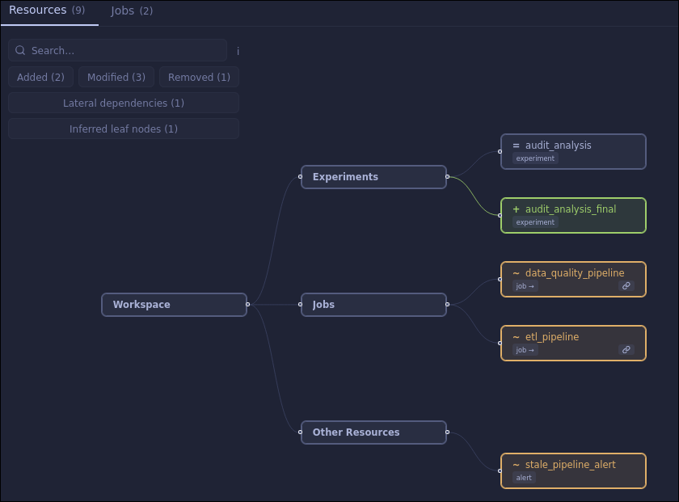
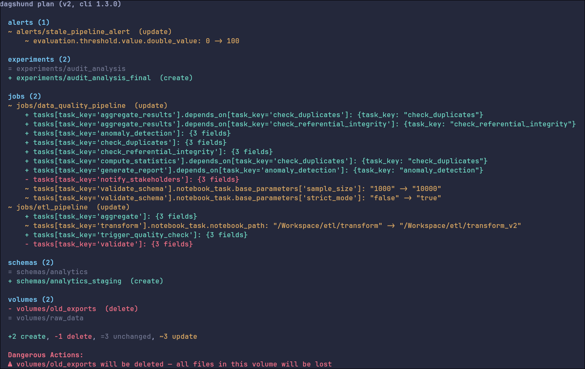
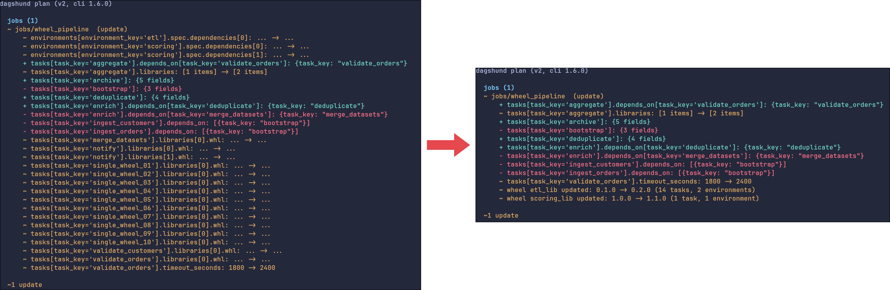
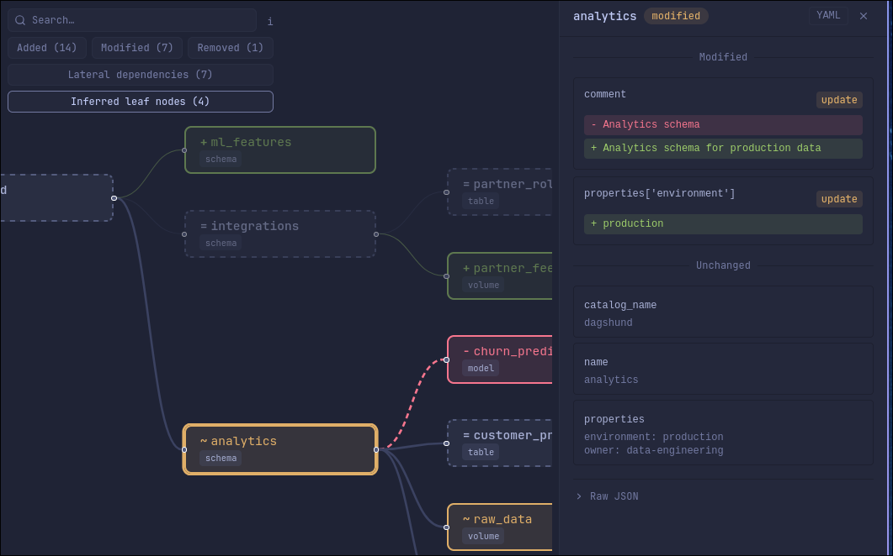
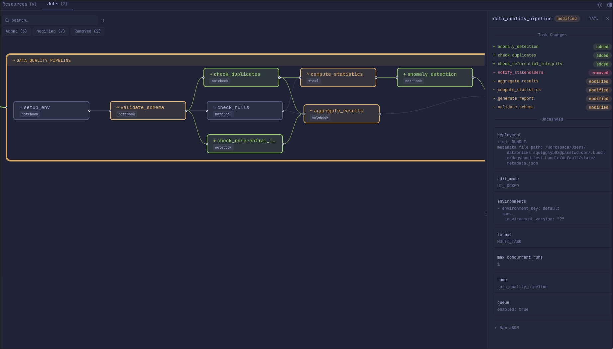
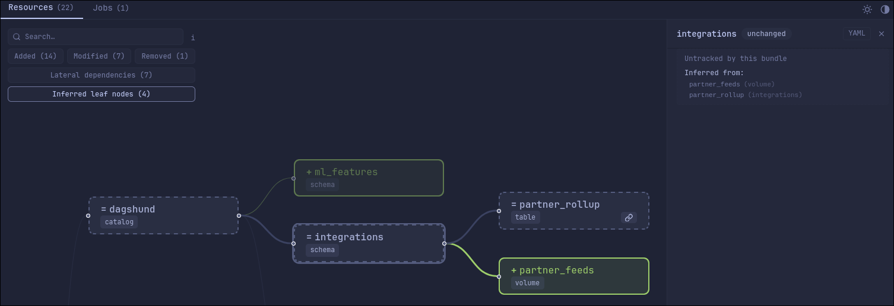
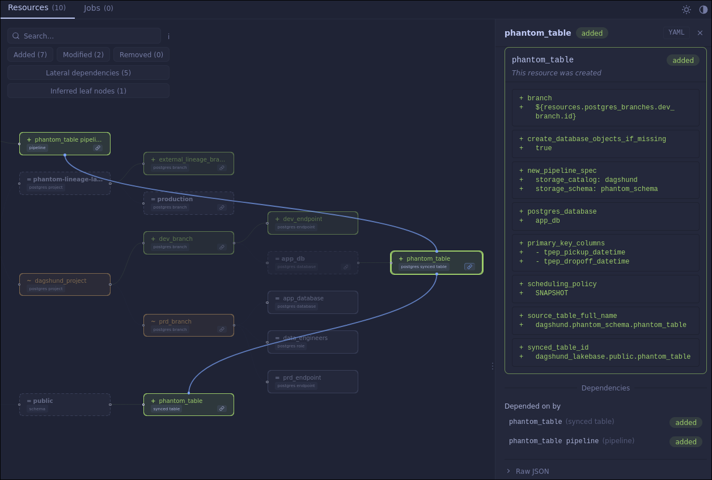
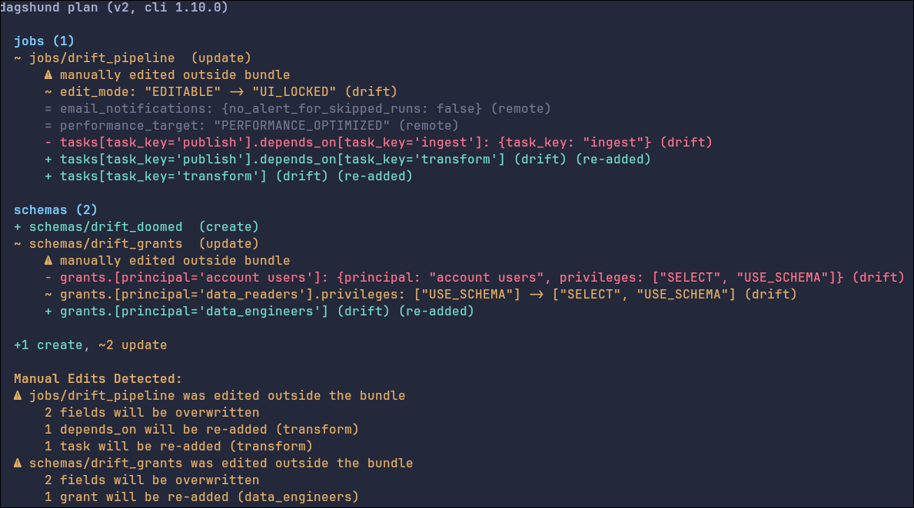
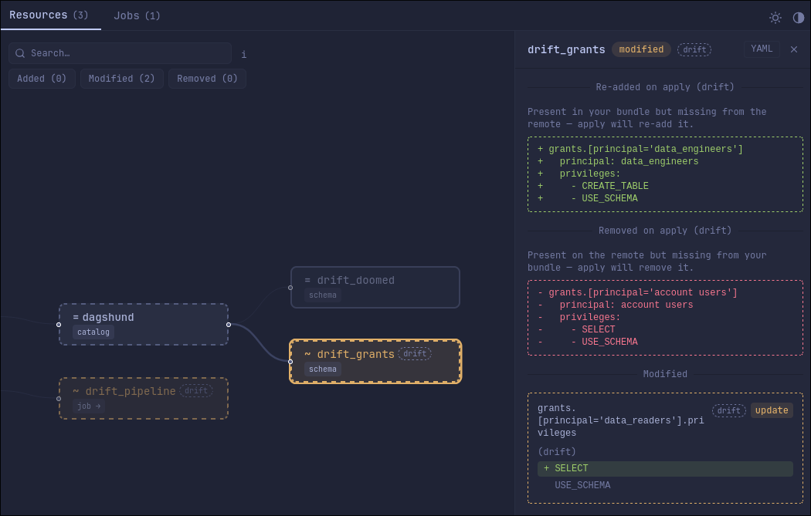
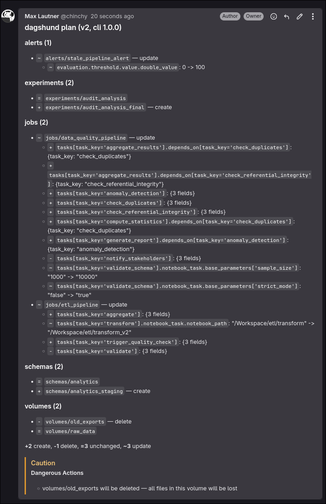

# Dagshund

Dagshund renders `databricks bundle plan -o json` output as a colored terminal diff, a markdown summary, or a self-contained HTML report with an interactive resource graph and per-job task DAGs. It is read-only: it does not connect to Databricks and does not deploy. The CLI is pure Python with no runtime dependencies.

Requires the [direct deployment engine](https://docs.databricks.com/aws/en/dev-tools/bundles/direct) for Declarative Automation Bundles (formerly Databricks Asset Bundles).



Try it live: [here](https://dagshund-806de7.gitlab.io). Renders the HTML report for each golden fixture.

## Where it fits

Dagshund sits between `databricks bundle plan` and `databricks bundle deploy`. Two places you would run it:

**Locally**, while working on a bundle. The terminal output gives you a quick glance at what a deploy would do, filterable by resource type, status, or changed field. The HTML report is for detailed inspection: browse the full resource graph, open a node to see its field-level diff, and switch to the Jobs tab to walk task dependencies.

**In CI**, for example on every PR against the target workspace. Pipe a plan into dagshund to post a markdown summary on the PR, upload the HTML report as a pipeline artifact for deeper inspection, and use `-e` exit codes to gate the pipeline: 0 for no changes, 2 for safe changes, 3 for dangerous actions or manual edits, 1 for errors.

## Install

Requires Python 3.12+. Last validated against Databricks CLI 1.14.0. Dagshund reads `databricks bundle plan -o json`, whose JSON shape can change between CLI releases.

```bash
# Install (recommended for regular use)
uv tool install dagshund

# Or run one-off without installing
uvx dagshund plan.json
```

## Local usage

By default, dagshund reads a plan file (or stdin) and prints a colored diff to the terminal:

```bash
dagshund plan.json
databricks bundle plan -o json | dagshund    # pipe straight from the Databricks CLI
```



Dagshund works anywhere, it just needs a plan JSON file. You don't need to run it from inside your bundle directory.

Filter to specific change types:

```bash
dagshund plan.json -c              # changed resources only (hides unchanged)
dagshund plan.json -a              # added only
dagshund plan.json -m              # modified only
dagshund plan.json -a -r           # added and removed
```

The filter flags (`-a`, `-m`, `-r`) compose freely. `-c` is shorthand for `-a -m -r`.

Use `-f` to filter by resource type, name, diff status, or changed field:

```bash
dagshund plan.json -f 'type:jobs'                # only jobs
dagshund plan.json -f 'status:added'             # only new resources
dagshund plan.json -f '"etl_pipeline"'           # exact name match
dagshund plan.json -f 'type:jobs pipeline'       # jobs matching "pipeline"
dagshund plan.json -f 'field:email_notifications' # resources whose diff touches that field
dagshund plan.json -c -f 'type:volumes'          # changed volumes only
```

All tokens in a filter expression AND together. `-f` composes with `-c`/`-a`/`-m`/`-r`: both must match. `field:` is a substring match against changed field names.

CI pipelines that rebuild your bundle's wheel on every run mark every task carrying that wheel as changed, burying real changes in noise. `--suppress-wheel-updates` collapses same-wheel version bumps into one summary line per job:

```bash
dagshund plan.json --suppress-wheel-updates
#   ~ jobs/etl_pipeline  (update)
#       ~ tasks[task_key='report'].notebook_task.base_parameters.mode: "daily" -> "hourly"
#       ~ wheel etl_lib updated: 0.1.0 -> 0.2.0 (12 tasks)
```

Only same-distribution version bumps are suppressed; swapping a task to a *different* wheel still shows in full. Works for classic compute (per-task `libraries`) and serverless (per-environment dependencies).



Deploy-triggered runs (the experimental `resources.job_runs` blocks, Databricks CLI 1.7.0+) fold onto the job they target instead of listing as separate resources. Each run renders as a per-job line with its lifecycle:

```bash
dagshund plan.json
#   = jobs/schema_migration
#       ~ run apply_migrations (re-runs on deploy)
#           ~ job_parameters['migration_version']: "v1" -> "v2"
#   = jobs/smoke_check
#       - run one_off_audit (run record will be deleted)
```

Deleting a `job_runs` entry deletes the recorded run from the job's history and reports `run record will be deleted`. Removing only `lifecycle.triggers.on_bundle_deploy` removes the deploy trigger, starts no run, and shows no play badge. With `--detailed-exitcode`, a plan whose only changes are deploy-triggered runs exits 2.

Export the HTML report with `-o` for detailed inspection in a browser:

```bash
dagshund plan.json -o report.html           # write HTML, keep terminal output
dagshund plan.json -o report.html -b        # also open in the default browser
dagshund plan.json -q -o report.html        # HTML only, suppress terminal output
```

Or emit a markdown summary to stdout with `--format md`:

```bash
dagshund plan.json --format md
```

## Interactive Visualization

The HTML report shows your resources as an interactive graph with diff highlighting. Resources are organized into visual groups:

- **Workspace**, jobs, alerts, experiments, pipelines, and other bundle resources. Repeated resource types are grouped into categories such as **Jobs** or **Pipelines**. When any category or Lakebase hierarchy exists, remaining singletons and unmatched inferred references share an **Other Resources** group.
- **Unity Catalog**, catalogs, schemas, volumes, and registered models in their hierarchy
- **Lakebase**, projects, branches, databases, endpoints, roles, and synced tables in their hierarchy under Workspace

Click any node to open a detail panel with per-field structural diffs, old values in red, new values in green, unchanged fields for context.



Jobs with task dependencies get their own DAG view. Switch between the Resources and Jobs tabs to navigate between them.



### Phantom Nodes

When a resource in your bundle references something that isn't in the bundle itself, dagshund infers the missing piece and adds it to the graph as a **phantom node** (shown with a dashed border). Two kinds: hierarchy phantoms (for example a parent catalog above a schema) always display to preserve the hierarchy's structure. Inferred leaf phantoms (for example a warehouse referenced by an alert) are off by default; toggle them with the **Inferred leaf nodes** button in the toolbar. A leaf joins an existing matching type category, but phantom nodes never create categories themselves.



### Lateral Dependencies

Many resources reference each other across hierarchies, an alert might target a SQL warehouse, or a serving endpoint might bind to a registered model. These relationships are off by default to keep the graph clean; toggle them with the **Lateral dependencies** button in the toolbar to see how your resources connect across group boundaries.



### Wheel Updates

When a plan contains wheel version bumps, the **Hide wheel updates** toolbar button appears in the Jobs view. Toggling it renders tasks whose only change is the wheel bump as unchanged and shows the bump once as a badge on the job container instead, so real changes stand out in large DAGs. Tasks with other changes stay highlighted.

### Deploy-Triggered Runs

Jobs targeted by `resources.job_runs` entries (experimental, Databricks CLI 1.7.0+) get a play badge: green when a run fires on this deploy, grey when a completed run already succeeded, and a distinct activity badge while a run is still in progress. The detail panel lists each run with its semantic outcome, a link to the existing run page, and the parameter diff that forces a re-run. A recreate with an armed `on_bundle_deploy` trigger says it runs on every deploy. Removing only `lifecycle.triggers.on_bundle_deploy` says the deploy trigger was removed and shows no badge. Deleting a `job_runs` entry reports `run record will be deleted`. Deploy-triggered runs never count toward tab counts or diff filters, and the target job itself stays unchanged.

### Search

The search bar dims non-matching nodes so matches stand out.

- Type a name to filter: `warehouse`, `analytics`
- Wrap in quotes for exact match: `"analytics"` finds only that node, not `analytics_pipeline`
- Prefix with `type:` to filter by badge: `type:wheel` highlights all wheel tasks
- Prefix with `status:` to filter by diff status: `status:added`, `status:modified`, `status:removed`
- Press **Escape** to clear

The diff filter buttons (**Added**, **Modified**, **Removed**) compose with search, when both are active, only nodes matching both criteria stay highlighted. When exactly one node matches, the viewport auto-centers on it.

## Manual Edit Detection

When someone edits a job directly in the Databricks UI (break glass), the bundle doesn't know about it. On the next deploy, those manual changes will be silently overwritten. Dagshund detects this by comparing the plan's expected state against the actual server state, and warns you when they diverge.

In the terminal:



In the HTML report:



The warning surfaces in both views whenever the plan's `old` and `remote` states differ.

## CI usage

Run dagshund in a CI pipeline to surface plan changes on every PR. One command produces all three CI outputs: markdown for the PR comment, HTML for a pipeline artifact, and an exit code for gating.

```bash
databricks bundle plan -t "$TARGET" -o json | \
  dagshund --format md -o report.html -e > summary.md
status=$?
```

Then in your pipeline step:

- Post `summary.md` as a PR comment with `gh pr comment`, `glab mr note`, or your provider's API.
- Upload `report.html` as a pipeline artifact for deeper inspection.
- Branch on `$status` to gate the deploy step.



Exit codes from `-e`:

| Code | Meaning |
|------|---------|
| 0 | Plan parsed, no changes detected |
| 1 | Error (bad input, missing file, etc.) |
| 2 | Plan parsed, changes detected |
| 3 | Plan parsed, changes detected AND dangerous actions or manual edits present |

Dangerous actions are deletes or recreates of stateful resources, including catalogs, schemas, volumes, registered models, experiments, and stateful Lakebase resources. Pipeline deletes or recreates are also dangerous unless `cascade_on_destroy` is explicitly `false`. Manual edits are detected whenever the plan's `old` and `remote` states differ.

Without `-e`, dagshund always exits 0 on success.

## Agent Skill

Dagshund ships an [Agent Skill](https://agentskills.io) at `skills/dagshund/SKILL.md`. Once installed, your agent can answer questions like *"what's changing in my deploy?"* by running dagshund automatically.

Install through dagshund itself:

```bash
uvx dagshund --install-skill .agents/skills   # Codex / Gemini CLI
uvx dagshund --install-skill .cursor/skills   # Cursor
uvx dagshund --install-skill .claude/skills   # Claude Code
```

Or install from an open skill indexer such as skills.sh:

```bash
npx skills add chinchyisbored/dagshund
```

Re-running `--install-skill` overwrites any existing `SKILL.md` at the target path without prompting.

## Development

The checked-in `flake.nix` and `flake.lock` define the development toolchain.
Run every repository development and maintenance command inside that Nix shell
so it never depends on undeclared host tools. For one-off commands:

```bash
nix develop --command just install
nix develop --command just check
nix develop --command just build
```

For interactive work, enter the shell once and run commands there:

```bash
nix develop
```

The shell provides Python 3.14, uv, Bun 1.4.0, Git and repository workflow
CLIs, and Databricks CLI 1.14.0. The Databricks CLI is built from its
checksummed GitHub release artifact rather than the Nixpkgs package. uv remains
responsible for the Python virtual environment and dependencies, but is
configured to use the Nix-provided interpreter without downloading Python.

## Contributing

Dagshund is a solo project and I'm not accepting pull requests at this time. If you run into a bug or have a feature request, please open an issue, I'm happy to hear what you need.

## License

MIT
